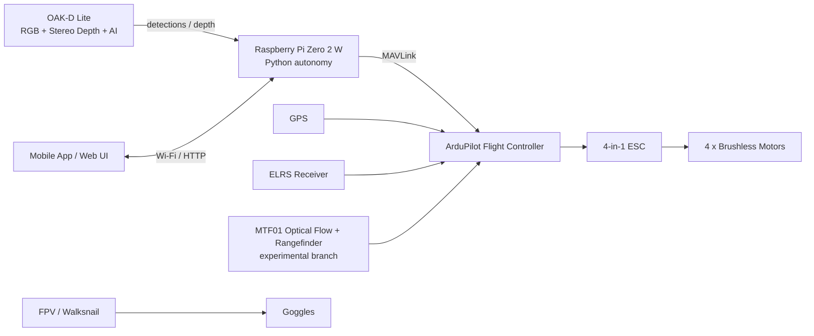
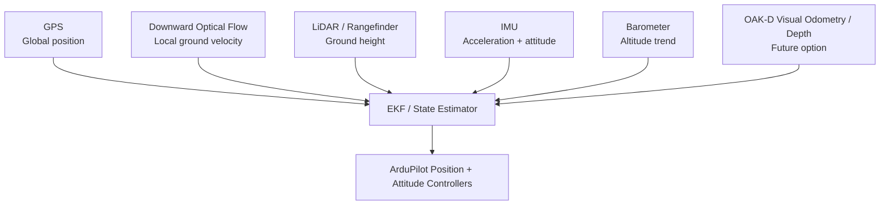

# Autonomous Follow-Me Drone

> **From simulation to a real flying computer-vision prototype using ArduPilot, MAVLink, Raspberry Pi, and OAK-D Lite.**

**Author:** Chijindu C. Okafor  
**Project status:** Current prototype phase complete / paused for further development  
**Main build and test period:** February–August 2026  
**Current write-up:** September 2026

---

## Overview

This project started with a simple question:

**Can I build a compact quadcopter that can see a person, make autonomous flight decisions, and follow or frame that person without relying entirely on a human pilot?**

The result was a working research/prototype platform built around a conventional flight controller for real-time stabilization and a companion-computer vision stack for higher-level autonomy.

The project went through almost every stage of a real robotics project:

- defining the autonomy architecture;
- selecting and changing hardware;
- building an ArduPilot Software-In-The-Loop simulation;
- writing MAVLink control code;
- integrating a Raspberry Pi companion computer;
- running computer vision on an OAK-D Lite depth camera;
- wiring GPS, RC, ESC telemetry, optical flow, and range sensing;
- testing autonomous takeoff, yaw scanning, target centering, movement, landing, and emergency behavior;
- building a mobile control interface;
- crashing, repairing, re-flashing, re-wiring, and debugging the aircraft;
- experimenting with GPS-denied navigation using optical flow and a rangefinder;
- and finally deciding where the prototype was successful and where it still needed engineering work.

This repository is intentionally not presented as a perfect finished consumer drone. It is the engineering record of a prototype that progressed from an idea to simulation, then to real hardware and real flight.

For me, the project was a success because the core architecture was proven end-to-end: **vision → companion computer → MAVLink → flight controller → aircraft response**. The remaining limitations were mainly around precise low-altitude position estimation and the time required to finish optical-flow calibration and tuning to the standard I wanted.

---

# 1. Project Goal

The initial goal was to create a **compact autonomous follow-me quadcopter** capable of performing a basic mission such as:

1. arm safely;
2. take off to approximately 1 m;
3. rotate/yaw while searching for a person;
4. detect the person with onboard computer vision;
5. rotate until the person is centered in the camera;
6. maintain a useful filming distance;
7. follow, hold position, or orbit depending on the selected behavior;
8. land automatically;
9. retain manual/emergency control at all times.

A major design objective was to keep the high-level autonomy separate from low-level flight stabilization.

I did **not** attempt to use a Raspberry Pi as the flight controller. Linux is not the right place for the hard real-time attitude-control loop of a quadcopter. Instead, I split the problem into two layers.

---

# 2. System Architecture



### Responsibility split

**Flight controller / ArduPilot**

- attitude stabilization;
- motor mixing;
- EKF state estimation;
- altitude and position control;
- flight modes;
- failsafes;
- RC input;
- ESC output;
- GPS / rangefinder / optical-flow sensor fusion.

**Raspberry Pi Zero 2 W**

- high-level state machine;
- person-follow logic;
- MAVLink commands;
- control-mode decisions;
- safety checks at the mission level;
- networking and mobile-app interface;
- video/recording control.

**OAK-D Lite**

- RGB video;
- stereo vision / depth;
- onboard neural-network inference;
- person detection;
- subject position in the frame;
- distance information used by experimental follow logic.

This architecture was one of the strongest outcomes of the project. Even when individual sensors or flight modes changed, the separation between **perception**, **mission logic**, and **real-time flight control** remained valid.

---

# 3. Hardware Used

The aircraft evolved during the project. The main prototype configuration used:

| Component | Hardware |
|---|---|
| Airframe | 5-inch quadcopter frame |
| Motors | 4 × V2207 V3.0 1950KV |
| Propellers | 5-inch props |
| Battery | 6S 1500 mAh LiPo |
| ESC | SpeedyBee 4-in-1 50 A |
| Final FC | SpeedyBee F405 V3 |
| Initial FC | Matek H743 Slim V3 |
| Companion computer | Raspberry Pi Zero 2 W |
| Vision/depth camera | Luxonis OAK-D Lite |
| Optical-flow/range sensor | MTF01; later an MTF01P was also purchased |
| GPS | WS-M181 / M10-class module during GPS-based testing |
| RC receiver | Cyclone ELRS 2.4 GHz Nano |
| Transmitter | RadioMaster Pocket / EdgeTX |
| FPV system | Walksnail Moonlight / Avatar system |

The first flight controller was a **Matek H743 Slim V3**. It was used during early bench development, but it was electrically damaged during the hardware phase and had to be replaced. I moved the build to a **SpeedyBee F405 V3** and rebuilt the flight-control configuration around it.

That failure became an important part of the project rather than something I wanted to hide. Real hardware development includes wiring mistakes, damaged parts, incompatible firmware, and recovery work. After that event I became much more deliberate about staged power-up, checking rails before connecting expensive peripherals, and testing one subsystem at a time.

Because the replacement FC was mounted with its arrow pointing toward the rear of the aircraft, the ArduPilot board orientation had to be corrected. One of the logs records `AHRS_ORIENTATION = 4` during this stage.

---

# 4. Why ArduPilot + Companion Computer?

I wanted the project to be autonomous, but I did not want the AI code to directly generate raw motor outputs.

The reasoning was:

- ArduPilot already provides a mature attitude controller, EKF, flight modes, motor output handling, failsafes, and sensor drivers.
- MAVLink provides a standard interface between a companion computer and the flight controller.
- The companion computer can send high-level commands such as velocity, yaw rate, takeoff, land, or mode changes.
- The flight controller remains responsible for turning those commands into stable aircraft motion.

In other words, the AI could ask the aircraft to **move forward at a controlled velocity** or **rotate toward a detected person**, but it did not directly control motor PWM.

That design made the project safer and much easier to debug.

---

# 5. Phase 1 — Software-In-The-Loop Simulation

Before trusting autonomous code on a real 5-inch quadcopter, I built the control logic in **ArduPilot SITL**.

My development environment used ArduPilot, MAVProxy, WSL/Linux, Python, and Mission Planner.

A typical simulator launch command was:

```bash
cd ~/ardupilot
python3 Tools/autotest/sim_vehicle.py -v ArduCopter --console --map
```

The SITL stage allowed me to test MAVLink code without risking hardware.

## What I proved in simulation

I successfully tested the building blocks required for the mission:

- connection to the simulated flight controller;
- arming;
- autonomous takeoff;
- altitude commands;
- yaw rotation / scanning;
- forward and backward body-frame motion;
- stopping motion;
- landing;
- combining target detection logic with flight commands.

One complete SITL test reached approximately **3 m**, performed the expected control actions, and landed again. An OAK-D/SITL integration test also demonstrated the perception-to-control path, with the simulated aircraft taking off and responding to target-distance / tracking logic.

This stage was extremely important. It separated **software bugs** from **hardware-flight problems**. If a state transition or MAVLink command was wrong in SITL, there was no reason to test it with spinning 5-inch props.

---

# 6. Phase 2 — Bench MAVLink and RC Testing

After SITL, I moved to the real flight controller with the propellers removed.

The early test philosophy was intentionally incremental:

**connect → receive heartbeat → read RC → arm → verify motor command path → disarm**

rather than immediately attempting autonomous flight.

A three-position RC channel was used as one of the physical triggers during development. Typical readings were approximately:

- down: `999`;
- middle: `1503`;
- up: `2000`.

The Python logic used threshold regions rather than expecting perfect exact values.

A props-off test proved the complete path:

**RC switch → Python companion logic → MAVLink → real FC → motor output → disarm**.

That was one of the first points where the project stopped being only a simulation and became a real integrated robotic system.

---

# 7. Flight-Controller and ESC Bring-Up

The motor/ESC path also required its own debugging.

At one point the ESC configuration path became difficult to access. I recovered the setup by using a Betaflight bootloader/firmware route to regain ESC configurator access and then returning the FC to ArduPilot.

I tested DShot configurations including DShot150, DShot300, and DShot600 during the process. A later ArduPilot log identifies the motor outputs as:

```text
RCOut: DS300:1-4 PWM:5-9
```

so DShot300 was one of the working configurations used during testing.

This was another useful lesson: in embedded projects, firmware and bootloader knowledge can be just as important as the Python application code.

---

# 8. Raspberry Pi Integration

The Raspberry Pi Zero 2 W was configured as a headless companion computer.

Its jobs included:

- starting the autonomy software;
- communicating with the flight controller through MAVLink;
- running the OAK-D/DepthAI pipeline;
- exposing status/control endpoints over Wi-Fi;
- recording or serving camera output;
- implementing mission-level safety logic.

## UART issue and recovery

The default Pi UART path was damaged during development. Rather than abandoning the companion-computer architecture, I remapped communication to an alternate UART using GPIO 12/13 and continued the build.

On the flight-controller side, the companion link was ultimately placed on the FC's UART6 / `SERIAL6` at **115200 baud** using MAVLink.

This was a good example of the practical difference between drawing an architecture diagram and making that architecture survive real hardware failures.

---

# 9. Serial / Peripheral Mapping

The final working wiring went through multiple revisions as GPS and optical-flow experiments were added or removed.

A representative mapping from the working setup was:

| ArduPilot serial port | Purpose |
|---|---|
| SERIAL0 | USB / ground station |
| SERIAL1 | MTF01 optical-flow/rangefinder experiment |
| SERIAL2 | GPS during earlier/final GPS configurations |
| SERIAL3 | ELRS receiver using CRSF |
| SERIAL5 | ESC telemetry |
| SERIAL6 | Raspberry Pi MAVLink link at 115200 |

Exact protocol values changed during firmware experiments, so the repository should be treated as an engineering history rather than a single immutable parameter dump.

---

# 10. OAK-D Lite Computer Vision

The OAK-D Lite was chosen because it could provide three useful things in one device:

1. RGB imagery;
2. onboard neural-network inference;
3. stereo depth.

The camera was connected to the Raspberry Pi, but the Pi did not need to perform every expensive vision operation itself. The OAK device could execute the neural network and depth processing, then send lightweight results to the mission code.

## Early person detection

Early person-detection tests achieved confidence values around **0.95–0.97** in normal test conditions.

I experimented with more than one pretrained detection pipeline during the project. Early testing used a MobileNet-SSD-style person detector; another later DepthAI experiment used `yolov6-nano` as an onboard detector.

The important engineering work was not claiming to have trained a new object detector from scratch. It was integrating a pretrained detector into a real-time robotics control loop and determining how detection output should become safe motion.

---

# 11. Person Centering and Yaw Control

One of the first real autonomous vision behaviors was deliberately simple:

**Do not follow forward yet. Just find a person and keep the person centered by yawing the drone.**

This reduced the number of uncontrolled variables during testing.

A later version of the code used parameters including:

```python
TARGET_ALTITUDE = 1.0
TRACK_SECONDS = 60

DEFAULT_SEARCH_YAW_RATE_DEG = 12.0
LOST_TARGET_YAW_RATE_DEG = 12.0

CENTER_X_TARGET = 0.50
CENTER_TOLERANCE = 0.03
YAW_CENTER_KP = 30.0
YAW_CENTER_MAX_DEG = 10.0
YAW_CENTER_MIN_DEG = 2.5

CONFIDENCE_THRESHOLD = 0.60
```

The logic was:

- if there was no valid person detection, rotate slowly to search;
- remember which side of the image the target was last seen on;
- if the person reappeared to the left, yaw left;
- if the person appeared to the right, yaw right;
- reduce the command as the person approached image center;
- stop yawing inside a small center deadband.

This was much better than simply commanding a fixed yaw angle every time a detection moved off center.

Earlier tests had shown approximately **30 degrees of overshoot** when yaw stopping was too abrupt. That led to slower, proportional yaw commands and a center tolerance instead of binary left/right rotation.

---

# 12. Using Depth for Follow Distance

For follow-me behavior, I did not want to estimate distance from bounding-box size alone.

Bounding-box area changes with pose, clothing, camera angle, partial occlusion, and body orientation. Because the OAK-D Lite already had stereo depth, the more sensible approach was:

- detect the person;
- determine the person's bounding box / center;
- sample a robust depth region around the target;
- filter the depth measurement;
- use the resulting distance error to command forward/backward velocity.

The control objective becomes:

```text
Distance error = measured person distance - desired follow distance
```

and then a bounded controller converts that error into body-frame forward/back velocity.

This approach was tested in simulation and in perception/control experiments. The real-world aircraft work reached the point where individual yaw, altitude, forward, and backward commands were functioning, but the final real-flight build was kept more conservative because horizontal position estimation was still the limiting part of the platform.

---

# 13. MAVLink Motion Commands

The autonomy code used MAVLink rather than raw motor commands.

One important command pattern was `SET_POSITION_TARGET_LOCAL_NED` in `MAV_FRAME_BODY_NED` so motion could be described relative to the drone's current heading.

Conceptually:

```text
vx > 0      -> move forward
vx < 0      -> move backward
vy          -> lateral motion
yaw_rate    -> rotate around the vertical axis
vz          -> vertical velocity in NED convention
```

Using body-frame velocity made sense for follow-me behavior because "move toward the person" could remain aligned with the camera/drone body rather than requiring the companion computer to constantly transform commands into global coordinates.

One experimental script used a MAVLink type mask of `1479` for velocity plus yaw-rate control.

---

# 14. Safety Logic

Safety was added progressively rather than being left until the end.

One test script included:

```python
TARGET_ALTITUDE = 1.0
ALT_DEADBAND = 0.08
ALT_KP = 0.22
ALT_MAX_VZ_NORMAL = 0.10

HIGH_ALTITUDE_WARN = 1.25
HIGH_ALTITUDE_LAND = 1.45
LOW_ALTITUDE_LAND = 0.55
EMERGENCY_DESCENT_VZ = 0.25
```

The same code listened for ArduPilot status messages containing battery-failsafe terms. If a critical condition was detected, the companion logic stopped velocity commands and requested `LAND`.

Other safety mechanisms used during the project included:

- propellers removed for early bench testing;
- physical RC override / manual control;
- explicit land command;
- stop-motion command;
- emergency stop in the mobile interface;
- limiting autonomous test duration;
- limiting yaw rate and translational velocity;
- moving from single-axis tests to multi-axis tests gradually.

The project still remained an experimental aircraft, so none of these should be interpreted as a production safety certification.

---

# 15. Mobile App — "Drolo"

I also built a simple mobile interface using Expo / React Native.

The interface evolved around the behaviors I wanted the final system to expose:

- **Scan**;
- **Follow Me**;
- **Hold**;
- **Orbit**;
- **Land**;
- **Emergency Stop**;
- recording controls.

The Pi hosted HTTP endpoints and status/video services. During development these included endpoints for actions such as:

```text
/status
/video_feed
/start_record
/stop_record
/download
```

The app was therefore not intended to replace ArduPilot's low-level flight controls. It was a mission-level UI that could ask the companion computer to start or stop predefined autonomous behaviors.

This architecture also left room for a future natural-language layer, where a user could say something like "follow me for 30 seconds and then land", but the language model would only be allowed to select validated behavior parameters — never directly generate arbitrary motor commands.

---

# 16. GPS-Based Flight

Although the original Phase-1 concept aimed to avoid dependence on GPS, GPS eventually became the practical horizontal-position reference used to complete the current prototype phase.

Why?

Because autonomous horizontal movement needs a usable state estimate. The flight controller needs to know whether the aircraft is actually stationary, drifting, or accelerating. A camera detecting a person does not automatically tell the FC how the aircraft itself is moving over the ground.

With GPS available, ArduPilot could use normal position-aware flight modes and the companion computer could concentrate on higher-level target behavior.

The GPS-based setup allowed me to continue real testing and demonstrate the end-to-end autonomy stack rather than spending the remaining project time only on sensor calibration.

## The limitation

Standard GPS is useful, but it is not ideal for a small follow-me aircraft operating at low altitude near a person.

Its practical errors can be significant relative to the distances involved in close filming. It can also be affected by:

- satellite geometry;
- multipath reflections;
- buildings and trees;
- temporary accuracy changes;
- low-speed position noise.

A position solution that is "good enough" for a waypoint hundreds of metres away may still allow visible drift when the goal is to hold a compact camera drone only a few metres from a subject.

That is why GPS solved the immediate project problem but was not the final answer I wanted for precision follow-me flight.

---

# 17. Optical Flow + LiDAR / Rangefinder Experiment

The intended solution for low-altitude local stability was a downward-facing optical-flow + rangefinder system.

I tested an **MTF01** and later purchased an **MTF01P**.

The idea is similar in concept to the downward vision-positioning approach used by many consumer camera drones:

- an optical-flow camera measures apparent motion of the ground;
- an IMU supplies high-rate attitude and acceleration;
- a rangefinder supplies distance to the ground;
- the estimator uses the height information to convert image motion into useful horizontal velocity;
- the EKF fuses the information into a local state estimate.

This is especially useful at low altitude where a textured ground surface is visible.

## ArduPilot configuration work

The project went through several ArduPilot versions because feature availability on the F405 target mattered.

I used/tested builds in the 4.4.x, 4.5.x, 4.6.x, and custom 4.7.x range. At one point I downgraded from 4.6.3 because the optical-flow parameters I needed were not exposed in that build configuration on this board. Later I used custom firmware with optical-flow and logging features enabled.

A recorded experimental configuration included:

```text
FLOW_TYPE = 5
FLOW_FXSCALER = 0
FLOW_FYSCALER = 0
FLOW_ORIENT_YAW = 0

RNGFND1_TYPE = 10
```

The rangefinder was configured as downward-facing (`ORIENT = 25`) in the test setup.

For the EKF, I experimented with optical flow as the horizontal velocity source and barometer/rangefinder combinations for height. The exact source parameters changed as I switched between GPS calibration flights and GPS-denied optical-flow tests, so I do not present one temporary EKF parameter snapshot as if it were the universal final configuration.

---

# 18. The GPS-Denied Problem

This became one of the most educational parts of the whole build.

When GPS was disabled, normal `GUIDED` mode could refuse to arm with:

```text
Need Position Estimate
```

because the estimator did not yet have a position solution it considered adequate for that mode.

I then experimented with `GUIDED_NOGPS`.

The aircraft could arm in that mode, but `MAV_CMD_NAV_TAKEOFF` did not behave the same way as a normal position-aware guided takeoff. Several thrust/velocity experiments did not produce the clean autonomous climb I expected during that debugging branch.

At the same time, the MTF01 range reading could sit near the floor value while the aircraft was on the bench, which made it very easy to confuse a mode/control problem with a sensor-state problem.

The key lesson was that **"GPS disabled" is not the same thing as "navigation solved without GPS."**

To fly well without GPS, another estimator source has to be correctly calibrated, fused, and trusted by the EKF.

---

# 19. Optical-Flow Calibration Attempt and Crash

ArduPilot provides an optical-flow calibration auxiliary function. I configured an RC option (`RC8_OPTION = 158` during one test) so calibration could be triggered in flight.

The calibration flight did not end successfully.

A damaged/chipped prop contributed to poor flight behavior. The aircraft began swaying, climbing/drifting, and eventually collided/crashed before a valid optical-flow calibration was completed.

The calibration values therefore did not update to a usable finished result.

This was one of the moments where the project could easily have been written up as a failure. Instead, it exposed several important engineering points:

- calibration flights require a mechanically healthy aircraft first;
- perception/navigation debugging should not be mixed with known propulsion defects;
- optical flow needs good logs and repeatable flight conditions;
- a bad horizontal state estimate can quickly turn a simple calibration maneuver into a crash;
- every new subsystem increases the number of failure interactions.

The drone was repaired and development continued.

---

# 20. Logging and SD-Card Problems

Optical-flow debugging made onboard logs much more important.

I ran into two separate challenges:

1. some firmware builds did not include the logging/feature set I wanted on the F405 target;
2. the SD-card/filesystem path later produced repeated errors, including attempts to create `/APM/LOGS` returning `EBUSY`.

I tried FAT32/MBR formatting and different firmware builds. I eventually built/flashed custom ArduPilot firmware with logging enabled so that the optical-flow and EKF data could be inspected.

One recovered log is very large and contains parameter snapshots, EKF records, optical-flow records, rangefinder data, RC data, and flight-controller messages.

A section of that log identifies:

```text
ArduCopter V4.7.0-beta7
speedybeef4v3
RCOut: DS300:1-4 PWM:5-9
Frame: QUAD/X
```

The log also records the flow, rangefinder, RC calibration option, serial-port settings, and FC orientation used during that experimental period.

---

# 21. What Actually Worked on the Real Hardware

By the end of the current phase, I had demonstrated or validated the following on real hardware at different stages of the project:

- a complete 5-inch ArduPilot quadcopter build;
- manual and stabilized flight;
- reliable RC/ELRS control;
- companion-computer MAVLink communication;
- reading real FC state and RC channels in Python;
- companion-triggered arm/disarm paths during controlled tests;
- autonomous takeoff/land building blocks;
- altitude up/down commands;
- yaw control;
- forward/back body-frame motion;
- OAK-D person detection on the Pi/OAK stack;
- camera-based target-centering logic;
- GPS-supported navigation/position estimation;
- rangefinder data reaching ArduPilot/MAVLink;
- optical-flow data reaching the FC during the experimental branch;
- mobile/web mission-control endpoints;
- onboard recording workflow;
- flight logs and parameter-level debugging.

The most important success was not one dramatic autonomous flight. It was proving that all of the major layers could communicate and influence a real aircraft.

---

# 22. What Was Proven Only in Simulation or Partial Tests

Some behaviors reached a more complete state in SITL than they did on the final physical aircraft.

These included the full sequence of:

```text
TAKEOFF
   ↓
YAW SCAN
   ↓
DETECT PERSON
   ↓
CENTER TARGET
   ↓
FOLLOW / CONTROL DISTANCE
   ↓
HOLD OR REACQUIRE
   ↓
LAND
```

The real platform validated the individual perception and motion building blocks, but the final project did **not** reach the point where I would describe it as a production-ready, fully GPS-independent follow-me drone.

That distinction matters.

---

# 23. Why I Stopped the Current Phase

The project was not stopped because there was no path forward.

It was stopped because the next stage required more time for:

- optical-flow calibration;
- estimator tuning;
- repeated safe test flights;
- mechanical repair/maintenance after crashes;
- higher-quality logging;
- more robust sensor fusion;
- obstacle sensing;
- and extensive validation.

By September 2026 I had started my master's programme, so I made the decision to close the current prototype phase rather than rush more flight tests.

The final demonstrator therefore used the more practical GPS-assisted route instead of pretending the optical-flow integration was complete.

I consider that the correct engineering decision.

---

# 24. GPS vs Optical Flow — How I Would Improve It

The next version would not simply remove GPS. It would **fuse more sensors**.

A stronger architecture would use:



### GPS would provide

- global location;
- long-range navigation;
- return-to-home reference;
- outdoor recovery if visual tracking becomes unreliable.

### Optical flow would provide

- high-rate local horizontal motion;
- lower visible drift at low altitude;
- better stationary hover when GPS is noisy;
- the possibility of indoor/GPS-denied operation under suitable surfaces and lighting.

### Rangefinder would provide

- precise height above ground at low altitude;
- the scale needed to interpret optical flow correctly;
- better 1 m filming-height control than relying only on barometer altitude.

### OAK-D could later provide

- visual odometry;
- depth-based obstacle information;
- stronger target tracking / re-identification;
- local scene understanding.

The key is **sensor fusion**, not treating any single sensor as perfect.

Optical flow also has limitations: poor texture, darkness, reflective surfaces, very high altitude, blur, and large attitude changes can all reduce quality. A production system should detect that loss of quality and fall back to GPS/VIO rather than blindly trusting the sensor.

---

# 25. Other Improvements I Would Make

## A. Better companion computer

The Pi Zero 2 W proved the architecture, but a future version could use a compact board with:

- native USB 3 host;
- eMMC;
- more RAM;
- stronger CPU;
- multiple reliable UARTs;
- better I/O robustness.

The OAK-D would still perform much of the vision acceleration.

## B. Dedicated state machine

I would formalize the mission software into explicit states such as:

```text
IDLE
PREARM_CHECK
TAKEOFF
SEARCH
TRACK_YAW
FOLLOW
TARGET_LOST
HOLD
LAND
EMERGENCY
```

Every transition would have timeouts, sensor-health requirements, and a defined fallback.

## C. Better target tracking

Detection alone is not tracking.

A stronger system would combine person detection with temporal tracking/re-identification so that the drone does not immediately switch to another person entering the frame.

## D. Obstacle sensing

The original roadmap included a rear distance sensor such as a TFmini-class sensor. A full follow-me system should have much wider obstacle awareness than a single rear sensor, but even that would be a useful first step for preventing blind backward motion.

## E. Improved mechanical reliability

A more mature prototype would include:

- better protected electronics;
- cleaner cable routing;
- vibration isolation for vision/navigation sensors;
- repeatable camera/sensor mounting angles;
- prop inspection as a mandatory pre-flight check;
- easier SD-card/log access.

## F. More formal testing

I would define a test matrix for:

- hover error;
- target-centering error;
- follow-distance error;
- reacquisition time;
- maximum safe target speed;
- wind response;
- GPS error;
- optical-flow quality by surface type;
- low-light performance;
- battery/failsafe behavior.

---

# 26. Failures and Lessons Learned

This project included multiple failures:

- an early flight controller was damaged;
- a Pi UART was damaged;
- firmware feature sets did not always match what the sensor integration required;
- ESC configuration required recovery work;
- GPS-denied guided behavior was more complicated than expected;
- optical-flow calibration was not completed;
- a calibration flight ended in a crash;
- damaged props caused instability;
- SD/logging problems slowed diagnosis;
- some control logic overshot before it was tuned;
- individual subsystems often worked before the complete system was stable.

Those failures were not wasted work.

The most important lessons I took from the project were:

1. **Simulate first.** SITL saved hardware and made autonomy logic much easier to validate.
2. **Separate flight control from AI.** Let the FC do the real-time stabilization and let the companion computer make mission decisions.
3. **Test one axis at a time.** Yaw-only target centering is far safer to debug than full 3D follow behavior.
4. **State estimation is the core problem.** Seeing a person is only half the task; the aircraft must also know its own motion accurately.
5. **Logs matter.** Without EKF/flow/range logs, navigation tuning becomes guesswork.
6. **Mechanical health comes before autonomy.** A bad prop can invalidate an entire sensor/control experiment.
7. **Do not hide limitations.** A GPS-assisted prototype that actually works is more valuable than claiming GPS-denied autonomy that is not yet stable.
8. **Robotics is integration.** The project required software, embedded systems, networking, electronics, estimation, control, mechanical work, and repeated debugging.

---

# 27. Project Outcome

I consider the current phase successful.

The project began as an idea for an autonomous camera drone and progressed to:

- a complete SITL environment;
- real MAVLink control code;
- a built and flyable quadcopter;
- a companion-computer architecture;
- onboard AI person detection;
- depth experiments;
- autonomous yaw/target-centering logic;
- controlled translational movement;
- GPS-supported autonomous flight building blocks;
- optical-flow/rangefinder integration experiments;
- a mobile mission interface;
- real test flights, crashes, repairs, and log analysis.

It is **not** a finished commercial product, and that is not what I want this repository to imply.

It is a serious autonomous-systems prototype that taught me how a real UAV autonomy stack has to be designed, integrated, tested, and debugged.

The next major milestone would be to finish the local-positioning stack with properly calibrated optical flow/range sensing — or move to a stronger VIO solution — and then re-run the full follow-me state machine on the real aircraft.

---

# 28. Technologies

`ArduPilot` · `ArduCopter` · `MAVLink` · `pymavlink` · `Python` · `Raspberry Pi` · `DepthAI` · `OAK-D Lite` · `Computer Vision` · `Stereo Depth` · `Optical Flow` · `LiDAR / Rangefinder` · `GPS` · `EKF` · `SITL` · `MAVProxy` · `Mission Planner` · `ELRS` · `Expo / React Native` · `Embedded Linux`

---

# 29. Closing Note

The biggest change in my understanding during this project was realizing that an autonomous follow-me drone is not primarily a "person detection" problem.

Person detection is only one input.

The real problem is building a system that can simultaneously answer:

- Where is the person?
- How far away are they?
- Where am I?
- How am I moving?
- Is my position estimate trustworthy?
- Is it safe to move?
- What should happen if the target disappears?
- What should happen if a sensor becomes unhealthy?
- Can the human pilot immediately regain control?

Building this prototype gave me hands-on experience with all of those questions.

That is why I consider it one of the most valuable engineering projects I have worked on so far.

---

# Author

**Chijindu C. Okafor**

This project was designed, built, programmed, integrated, tested, repaired, and documented as a hands-on autonomous UAV research and engineering project.

For professional inquiries, collaboration, or questions about the project, please contact me through my GitHub or LinkedIn profile associated with this repository.

---

## Project Disclaimer

This repository documents an experimental research prototype. It is not a certified commercial flight system, and the software, hardware configurations, parameters, and test procedures should not be treated as production-ready safety guidance. UAV testing should always be performed in accordance with applicable aviation regulations, local laws, equipment limitations, and appropriate safety procedures.
